<div dir="rtl">

<p align="left">
  <a href="README.md">العربية</a> · 
  <a href="README_en.md">English</a> · 
  <a href="README_he.md">עברית</a>
</p>

<p align="center">
  
</p>

<p align="center">
  <a href="https://github.com/zedreash/MedCare-App/releases/download/v1.0.0/MedCare-v1.0.0.apk">
    
  </a>
</p>

<p align="center">
  
  
  
  
</p>

<br>

# MedCare

تطبيق أندرويد مفتوح المصدر لإدارة العيادات والمرضى والمواعيد. يعمل بالكامل على الجهاز بدون اتصال بالإنترنت أو اعتماد على خوادم خارجية.

معظم تطبيقات إدارة العيادات تحتاج اتصالاً مستقراً بالإنترنت وخوادم سحابية. هذا ليس متاحاً دائماً. انقطاع الكهرباء، فترات عدم الاتصال، والتعطل في البنية التحتية تحدث بشكل يومي، خاصة في أماكن مثل فلسطين والعيادات الريفية والفرق الصحية المتنقلة.

MedCare مصمم لهذا الواقع. كل شيء يعمل محلياً على جهاز Android. سجلات المرضى، المواعيد، النسخ الاحتياطي، والنقل كلها تحدث على هاتفك دون الاعتماد على أي جهة خارجية. إذا انقطع الإنترنت أو فقدت العيادة الكهرباء، بياناتك وسير عملك تبقى كما هي.

العمل بدون إنترنت لا يعني انعدام الحماية. قاعدة البيانات مشفرة بـ SQLCipher على الجهاز، فلا يمكن لأحد الوصول لبيانات المرضى حتى إذا ضاع الجهاز أو سُرق. النسخ الاحتياطي مشفر بـ AES-256-GCM بكلمة مرور تتحكم أنت فيها. القفل البيومتري يحمي الدخول اليومي للتطبيق. وينفذ النسخ الاحتياطي التلقائي بجدول تحدده أنت، فيكون بياناتك محمية حتى إذا نسيت عمل نسخة احتياطية يدوياً.

<br>

## لقطات الشاشة

<p align="center">
  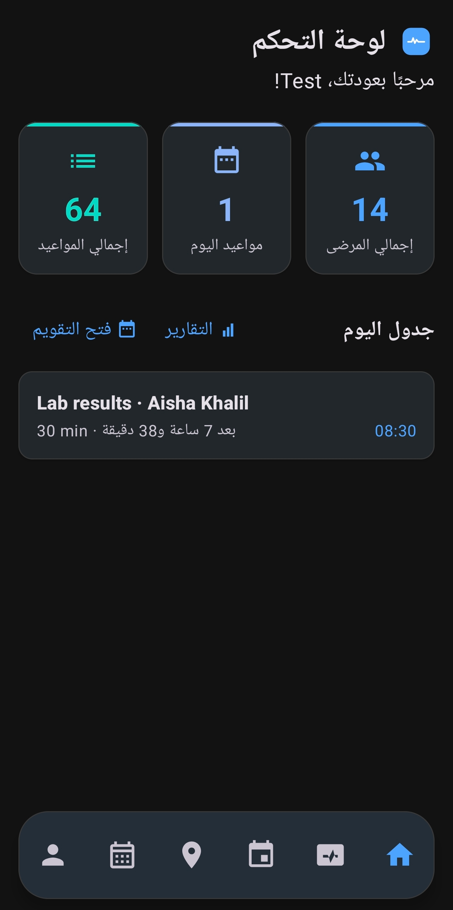
  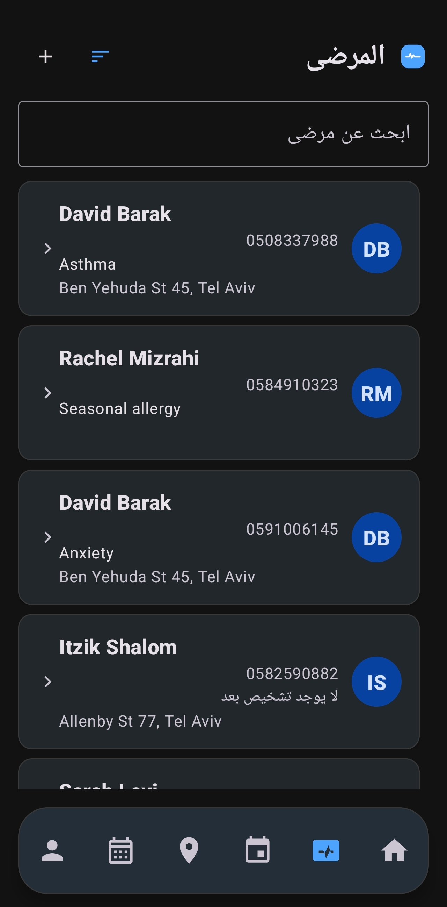
  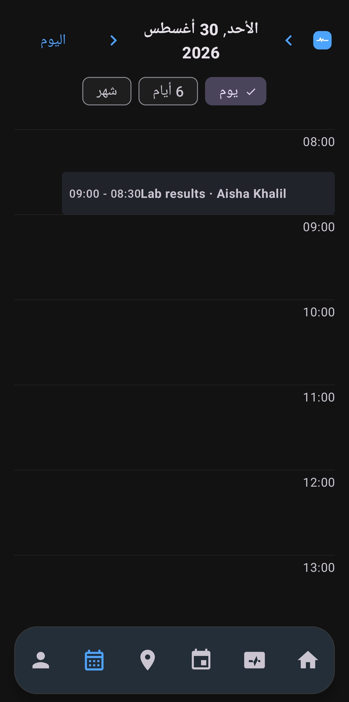
  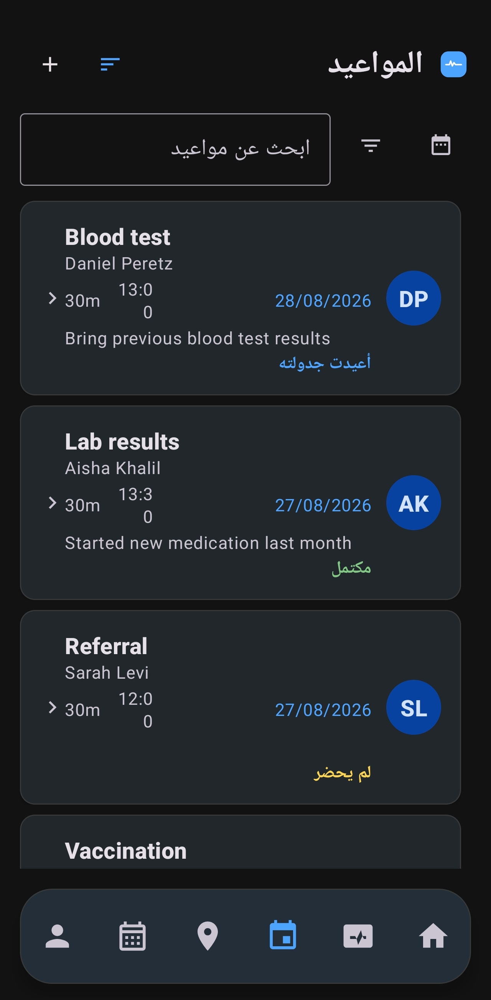
</p>

<p align="center">
  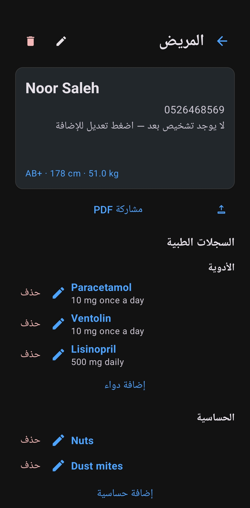
  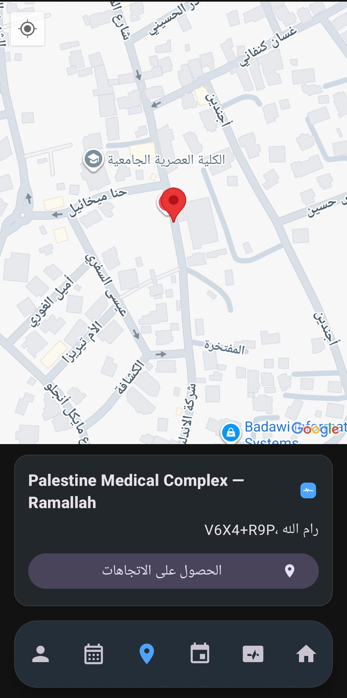
  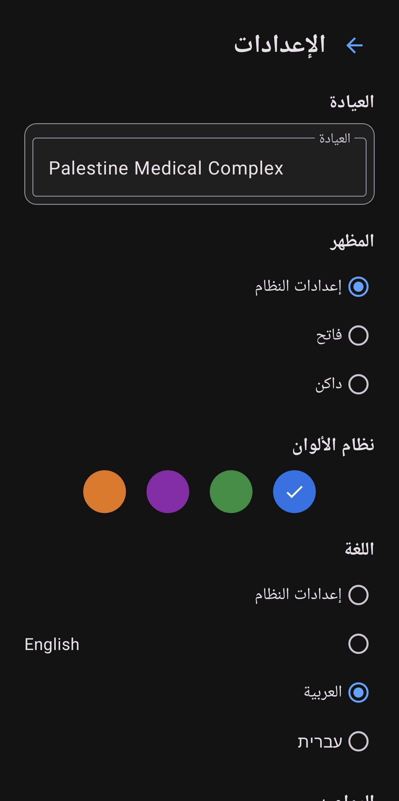
  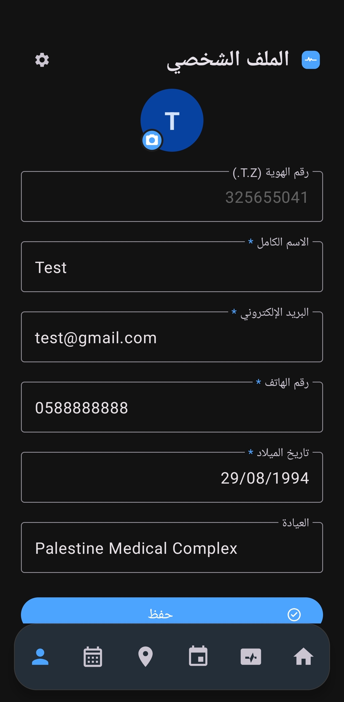
</p>

<br>

## الميزات الرئيسية

### إدارة المرضى

- الاسم الكامل، الهاتف، التشخيص، العنوان، ملاحظات
- قياسات حيوية: فصيلة الدم (A+/-, B+/-, AB+/-, O+/-)، الطول بالسم، الوزن بالكجم
- أدوية مع حالة نشط/غير نشط لكل دواء (الاسم والجرعة)
- سجل الحساسية مع ملاحظات لكل حساسية
- سجل العلاج والتاريخ الطبي مع التواريخ والتفاصيل
- مرفقات: صور، مستندات، أي نوع ملف محفوظ في ملفات التطبيق
- تصدير ملخص المريض كملف PDF يتضمن جميع البيانات والعناوين المreverse-geocoded
- حذف المريض يحذف تلقائياً جميع المواعيد والأدوية والحساسيات والتاريخ والمرفقات المرتبطة به

### المواعيد والتقويم

- 3 عروض للتقويم:
  - **يومي**: جدول بالساعات من 00:00 إلى 23:00 مع خط "الآن" الأحمر، المواعيد مرسومة حسب الوقت والمدة مع توسيع للأحداث المتداخلة
  - **أسبوعي (6 أيام)**: 6 أعمدة لكل يوم مع شارات المواعيد، العمود الحالي مميز
  - **شهري**: شبكة تقليدية مع نقاط ملونة لعدد المواعيد (حتى 3 نقاط + "+N")
- السحب للتنقل بين التواريخ مع رسوم متحركة انسيابية
- زر "اليوم" للعودة للتاريخ الحالي
- مواعيد متكررة: يومي، أسبوعي، كل أسبوعين، شهري، ربع سنوي، سنوي، أو فترات مخصصة بعدد محدد من التكرارات
- حالات المواعيد: مجدول، مكتمل، لم يحضر، معاد، ملغي (كل حالة بلون مميز)
- فلتر الحالات في قائمة المواعيد مع الاختيار المتعدد
- تذكيرات تلقائية مع وقت مسبق قابل للتعديل (15 دقيقة، 30 دقيقة، ساعة، يوم، أو مخصص)
- متابعة بعد انتهاء الموعد: إشعار "هل حضر المريض؟" مع خيارات فورية: حضر، لم يحضر، أو أسأل مرة أخرى (30 دقيقة أو ساعة)
- تعيين حالة الموعد مباشرة من شاشة التفاصيل
- تأجيل موعد: اختيار تاريخ ووقت جديد مع كشف التعارضات، تأجيل هذا الموعد فقط أو السلسلة بأكملها
- حذف موعد واحد أو حذف السلسلة بأكملها

### صفحة العيادة

- خريطة Google Maps مع 3 أنواع علامات:
  - علامات زرقاء: موقع المستخدم الحالي
  - علامات حمراء: موقع العيادة
  - علامات خضراء: مواقع جميع المرضى الذين لديهم إحداثيات
- معلومات العيادة: اسم وعنوان م reverse-geocoded
- زر "الاتجاهات" لفتح Google Maps للتنقل
- النقر على علامة مريض يعرض حواراً بالاسم والهاتف والعنوان والتشخيص مع خيارات "عرض المريض" و"الاتجاهات"
- قائمة بالعيادات القريبية مع اقتراحات بناءً على المسافة (تلقائية في منطقة إسرائيل/فلسطين، وقائمة مميزة في أماكن أخرى)
- تعديل اسم العيادة والإحداثيات من ملف التعريف

### التقارير والسجلات

- شاشة تقارير تعرض إحصائيات شاملة:
  - إجمالي المرضى والمواعيد ومواعيد هذا الشهر
  - توزيع الحالات: مجدول، مكتمل، لم يحضر، ملغي، معاد
  - نسبة عدم الحضور كنسبة مئوية
  - أكثر ساعة ازدحاماً
- سجل نشاط لكل حساب مع طوابع زمنية
- تصدير التقرير كملف PDF قابل للمشاركة

### النسخ الاحتياطي ونقل البيانات

- **نسخ احتياطي مشفر بكلمة مرور**: تصدير JSON → تشفير AES-256-GCM → ملف .medcare
- تكرار تلقائي: كل ساعة، يومياً، أسبوعياً، شهرياً، أو سنوياً
- تغيير كلمة المرور يعيد تشفير جميع النسخ الاحتياطية الموجودة تلقائياً
- كل ملف يحتوي على: MAGIC + إصدار + البريد الإلكتروني + البيانات المشفرة
- قائمة النسخ الاحتياطية تعرض حجم الملف والبريد الإلكتروني والوقت
- تصدير واستيراد كملفات .medcare مع تشفير AES-GCM بكلمة مرور
- **نقل مباشر من جهاز إلى جهاز**: إرسال البيانات عبر البلوتوث والواي فاي بدون إنترنت باستخدام Google Nearby Connections
- شرح موجز قبل بدء الإرسال/الاستقبال
- تفعيل البلوتوث تلقائياً إذا كان معطلاً
- دعم الحسابات المتعددة: عدة عيادات أو أطباء على جهاز واحد، كل حساب مع بياناته المعزولة تماماً
- صورة ملف شخصي لكل حساب مع دعم التخزين المحلي والنسخ الاحتياطي
- استعادة تلقائية: عند فتح التطبيق لأول مرة مع ملفات نسخ احتياطي متاحة، يعرض حواراً بأحدث نسخة لكل حساب

### الأمان والخصوصية

- **تشفير قاعدة البيانات**: SQLCipher يشفّر ملف SQLite بالكامل على الجهاز، المفتاح مشفر عبر Android Keystore، لا يوجد نص واضح للمفتاح في أي مكان على القرص
- **تشفير النسخ الاحتياطي**: AES-256-GCM مع PBKDF2 لاشتقاق المفتاح من كلمة المرور (120,000 دورة)
- **قفل بيومتري**: بصمة اليد أو التعرف على الوجه مع تشفير قوي، مقاومة لعمليات إعادة التشغيل
- **جلسات مربوطة بالحساب**: تسجيل الخروج يمسح الجلسة
- **مسح البيانات**: حذف جميع بيانات الحساب الحالي فقط (المرضى، المواعيد، السجلات، الملفات المرفقة، صورة الملف الشخصي، وحساب المستخدم نفسه) مع تأكيد كلمة المرور وكتابة كلمة التأكيد
- **حذف الحساب**: نفس إجراء مسح البيانات، مقيد بالحساب الحالي فقط
- لا توجد بيانات تُرسل إلى أي خادم خارجي أبداً

### التسجيل والإعداد

- معالج تسجيل من 6 خطوات:
  1. **نموذج الحساب**: رقم الهوية، الاسم الكامل، البريد الإلكتروني، الهاتف، تاريخ الميلاد، كلمة المرور + تأكيد، العيادة (مع اقتراحات Places)
  2. **كلمة مرور النسخ الاحتياطي**: مولد كلمات مرور عشوائي آمن (22 حرف)، مؤشر قوة، تأكيد "حفظتها"
  3. **اختيار السمة**: أزرق، أخضر، بنفسجي، برتقالي
  4. **القفل البيومتري**: تفعيل أو تخطي
  5. **تكرار النسخ الاحتياطي**: إيقاف / كل ساعة / يومياً / أسبوعياً / شهرياً / سنوياً
  6. **العمل في الخلفية**: استثناء تحسين البطارية + إذن المنبّهات الدقيقة
- 8 سمات مدمجة (4 ألوان × وضعين: فاتح/داكن + نظام)
- 3 لغات: العربية، الإنجليزية، العبرية مع دعم كامل للكتابة من اليمين لليسار
- زر لتبديل اللغة على شاشتي تسجيل الدخول والتسجيل

### العمل في الخلفية

- **BackgroundScheduler**: يجدول منبّهاً واحداً دقيقاً (`setExactAndAllowWhileIdle`) لأقرب لحظة تحتاج عمل خلفي (تذكير، نسخ احتياطي، متابعة)
- **MedCareBackgroundService**: خدمة أمامية قصيرة الأجل ت 작업_due_work ثم تعيد جدولة المنبّه
- **BootReceiver**: يعيد تفعيل المنبّهات بعد إعادة تشغيل الجهاز
- إرشادات للاستثناء من تحسين البطارية أثناء التسجيل
- WorkManager كخطة احتياطية إذا فُقدت المنبّهات الدقيقة
- استعادة المنبّهات تلقائياً بعد إعادة تشغيل الجهاز

<br>

## هيكل التطبيق

<p align="center">
  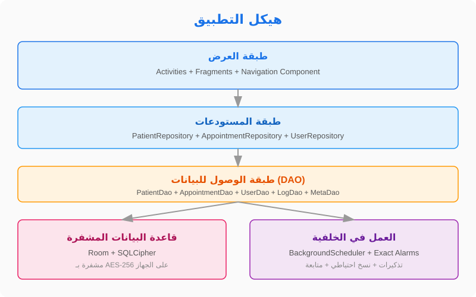
</p>

المبنى على معمارية طبقات بسيطة ونظيفة:

| الطبقة | الوصف |
|---|---|
| **العرض** | Activity واحدة (`MainActivity`) مع 16 شاشة عبر Fragments وNavigation Component، شريط تنقل سفلي بـ 6 تبويبات |
| **المستودعات** | `PatientRepository`، `AppointmentRepository`، `UserRepository` — كل وحدة تتعامل مع الـ DAO الخاص بها |
| **الوصول للبيانات** | Room DAOs: `PatientDao`، `AppointmentDao`، `UserDao`، `LogDao`، `MetaDao`، وأربعة DAOs إضافية للأدوية والحساسيات والتاريخ والمرفقات |
| **قاعدة البيانات** | Room 2.6.1 + SQLCipher 4.8.0 (مشفرة بـ AES-256)، الإصدار 1 بدون ترحيل |
| **الخلفية** | `BackgroundScheduler` + `MedCareBackgroundService` + `BackgroundAlarmReceiver` + `BootReceiver` + WorkManager |

<br>

## مسار التشفير

<p align="center">
  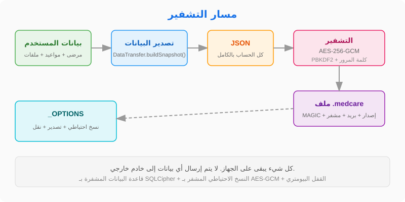
</p>

جميع البيانات مشفرة على مستويين:

**قاعدة البيانات (في الاستخدام اليومي):**
- SQLCipher يشفّر ملف SQLite بالكامل على الجهاز
- المفتاح مشفر عبر Android Keystore (لا يوجد نص واضح في أي مكان)
- `AppDatabase.ensureUsable` يتحقق من إمكانية فتح قاعدة البيانات عند كل تشغيل
- إذا فُقد المفتاح (تغيير قفل الشاشة، مسح بيانات التطبيق)، تُحذف قاعدة البيانات وتبدأ من الصفر

**النسخ الاحتياطي (عند التصدير):**
- `DataTransfer.buildSnapshot()` يبني صورة كاملة للحساب الحالي فقط (بدون كلمة مرور المصادقة)
- التصدير: JSON → تشفير AES-256-GCM → ملف .medcare
- PBKDF2 لاشتقاق المفتاح من كلمة المرور (120,000 دورة)
- كل ملف يحتوي على: MAGIC("MEDBACKUP") + إصدار(2) + طول البريد + البريد الإلكتروني + البيانات المشفرة
- تغيير كلمة المرور في الإعدادات يعيد تشفير جميع النسخ الاحتياطية الموجودة (`BackupManager.reencryptAll`)

<br>

## النقل المباشر بين الأجهزة

<p align="center">
  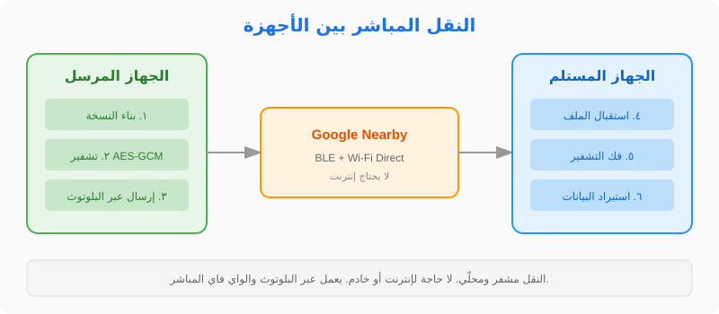
</p>

النقل يتم عبر Google Nearby Connections مع استراتيجية `P2P_CLUSTER`:

**الإرسال (من شاشة الملف الشخصي):**
- فحص الأذونات: الموقع الدقيق، البلوتوث (API 31+)، أجهزة الواي فاي (API 33+)
- التحقق من تفعيل خدمات الموقع والبلوتوث
- بدء الإعلان (`advertising`) مع معرّف الخدمة
- عند قبول الاتصال: بناء النسخة وحفظها في ملف مؤقت وإرسالها كـ `Payload.fromFile()`
- حذف الملف المؤقت بعد نجاح النقل

**الاستقبال (من شاشة تسجيل الدخول):**
- فحص الأذونات نفسه
- بدء الاكتشاف (`discovery`) لنفس معرّف الخدمة
- عند العثور على نقطة نهاية: طلب اتصال
- عند القبول: استقبال الملف وقراءته عبر `Payload.File.asUri()`
- تحليل JSON واستدعاء `DataTransfer.restoreSnapshot()` — استيراد معامل وآمن
- `ImportFlow.handleRestoreResult()` يتعامل مع النتيجة

<br>

## التقنيات المستخدمة

| المكتبة | الإصدار | الاستخدام |
|---|---|---|
| Room | 2.6.1 | قاعدة البيانات المحلية مع DAOs و="" migrations |
| SQLCipher | 4.8.0 | تشفير قاعدة البيانات بالكامل على الجهاز |
| Navigation Component | 2.7.6 | التنقل بين 16 شاشة عبر nav_graph.xml |
| Material Design 3 | 1.11.0 | واجهة المستخدم مع 8 سمات مخصصة |
| Google Maps | 18.2.0 | خريطة العيادة ومواقع المرضى |
| Google Places | 3.3.0 | اقتراحات العيادات القريبية |
| Nearby Connections | 19.0.0 | النقل المباشر بين الأجهزة |
| WorkManager | 2.9.0 | النسخ الاحتياطي والتذكيرات كخطة احتياطية |
| Biometric | 1.2.0 | القفل البيومتري مع مقاومة إعادة التشغيل |
| Gson | 2.10.1 | تسلسل JSON للنسخ الاحتياطي والنقل |

<br>

## البناء من المصدر

**متطلبات البناء:**
- Android Studio Hedgehog أو أحدث
- JDK 11+
- Android SDK 34

```bash
# استنساخ المستودع
git clone https://github.com/zedreash/MedCare-App.git
cd MedCare-App

# بناء الإصدار التجريبي
./gradlew assembleDebug

# بناء الإصدار النهائي (يحتاج ملف keystore)
./gradlew assembleRelease
```

**ملاحظة:** للحصول على خرائط Google Maps، أضف مفتاح API في ملف `secrets.properties` في جذر المشروع:
```
MAPS_API_KEY=مفتاحك_هنا
```

<br>

<p align="center">
  بياناتك تبقى على جهازك. لا يتم إرسال أي شيء إلى خادم خارجي.
</p>

</div>
