<p align="left">
  <a href="README.md">العربية</a> · 
  <a href="README_en.md">English</a> · 
  <a href="README_he.md">עברית</a>
</p>

<p align="center">
  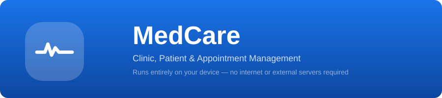
</p>

<p align="center">
  <a href="https://github.com/zedreash/MedCare-App/releases/download/v1.0.0/MedCare-v1.0.0.apk">
    
  </a>
</p>

<p align="center">
  
  
  
  
</p>

<br>

# MedCare

An open-source Android app for managing clinics, patients, and appointments. Runs entirely on-device with no internet dependency or external servers.

Most clinic management tools require a stable internet connection and cloud servers. That is not always available. Power outages, connectivity gaps, and infrastructure disruptions happen daily, especially in places like Palestine, rural clinics, and mobile health teams.

MedCare was built for this reality. Everything runs locally on your Android device. Patient records, appointments, backups, and transfers all happen on your phone with no outside dependency. If the internet goes down or the clinic loses power, your data and workflow stay intact.

Going offline does not mean being exposed. The database is encrypted at rest with SQLCipher, so a lost or stolen device will not give anyone access to patient data. Backups are encrypted with AES-256-GCM under a passphrase you control. Biometric lock keeps everyday access secure. And automatic backups run on a schedule you choose, so data is protected even if you forget to back up manually.

<br>

## Screenshots

<p align="center">
  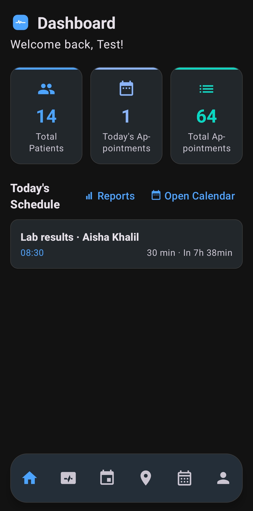
  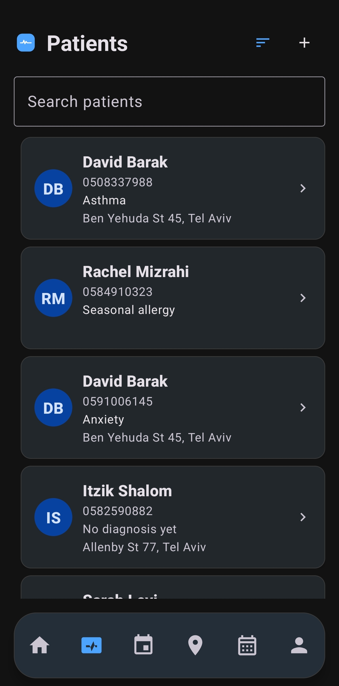
  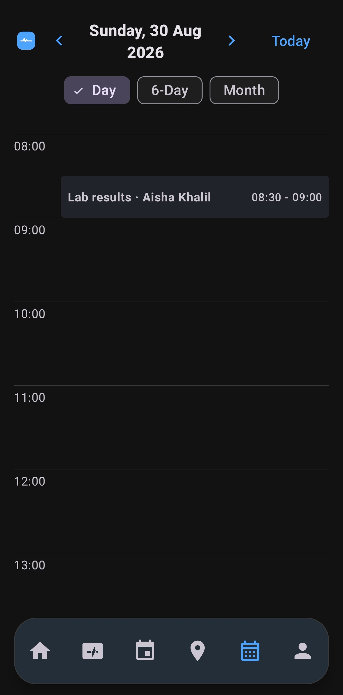
  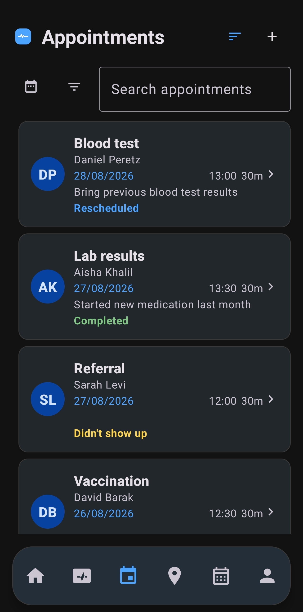
</p>

<p align="center">
  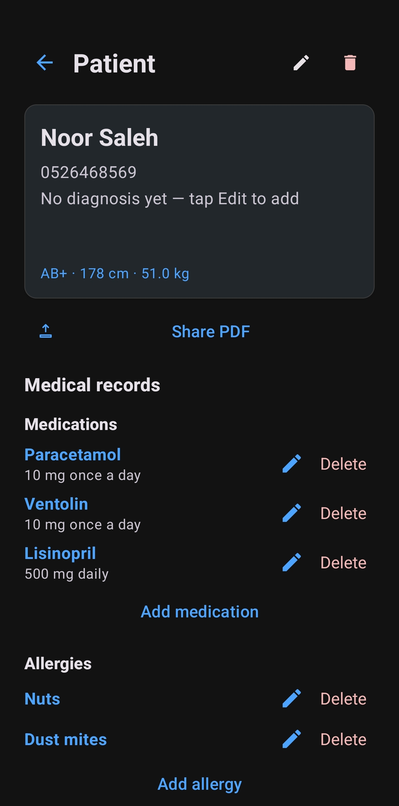
  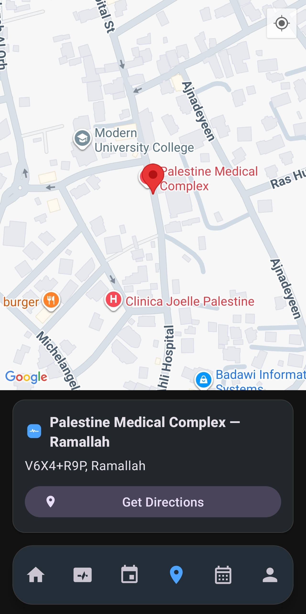
  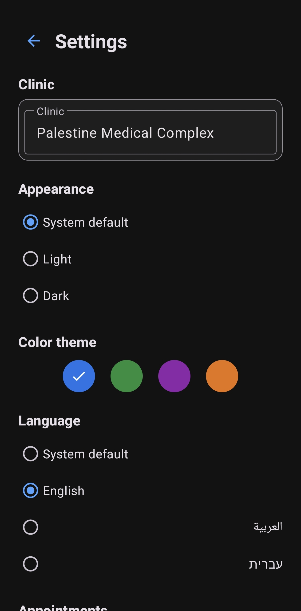
  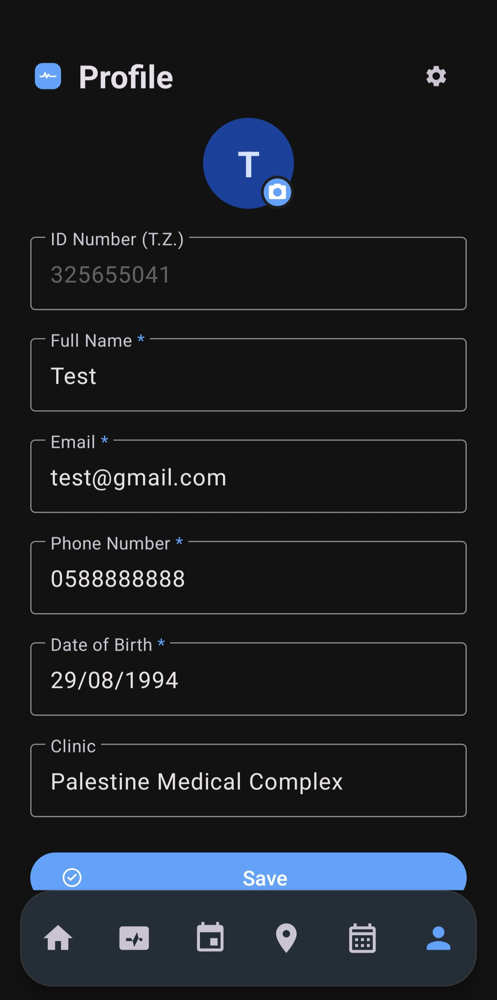
</p>

<br>

## Key Features

### Patient Management

Full patient profiles with:
- Name, phone, diagnosis, address, notes
- Vitals: blood type (A+/-, B+/-, AB+/-, O+/-), height in cm, weight in kg
- Medications tracker with active/inactive status per medication (name and dosage)
- Allergy list with notes per allergy
- Medical history and treatment records with dates and details
- File attachments: images, documents, any file type stored in app files
- Patient summary PDF export including all data and reverse-geocoded addresses
- Deleting a patient cascades to all linked appointments, medications, allergies, history, and attachments

### Appointments and Calendar

Three calendar views:
- **Day**: hour-by-hour timeline (00:00-23:00) with red "now" line, appointments positioned by time with duration height, expand/collapse for overlapping events
- **6-day week**: 6 columns per day with appointment chips, today's column highlighted, tap header to switch to day view
- **Month**: traditional grid with colored dots for appointment counts (up to 3 dots + "+N"), today and selected day highlighted

Swipe to navigate between dates with smooth slide animations. "Today" button to return to current date.

Recurring appointments: daily, weekly, biweekly, monthly, quarterly, yearly, or custom intervals with a set number of repetitions.

Appointment statuses: Scheduled, Completed, No-show, Rescheduled, Cancelled (each color-coded). Multi-select status filter on the appointment list.

Automatic reminders with configurable lead time (15 min, 30 min, 1 hour, 1 day, or custom).

Follow-up after appointment ends: notification asking "Did the patient show up?" with one-tap options: Showed up, No-show, or Ask again in 30 min / 1 hour.

Change status directly from the appointment detail screen. Reschedule with date/time pickers and conflict detection, either this appointment only or the entire series.

### Clinic Page

Google Maps with three marker types:
- Blue markers: current user location
- Red marker: clinic location
- Green markers: all patients with coordinates

Clinic info with name and reverse-geocoded address. "Get Directions" button opens Google Maps for navigation.

Tap a patient marker to see a dialog with name, phone, address, diagnosis, and options to "View Patient" or "Get Directions".

Curated popular clinic list with proximity-based suggestions (auto in Israel/Palestine region, curated list elsewhere). Editable clinic name and coordinates from the profile.

### Reports and Activity Logs

Comprehensive statistics screen showing:
- Total patients, total appointments, this month's appointments
- Status breakdown: scheduled, completed, no-show, cancelled, rescheduled
- No-show rate as a percentage
- Busiest hour of the day

Per-account activity log with timestamps. Report PDF export for sharing.

### Backup and Data Transfer

**Passphrase-encrypted backups**: export JSON, encrypt with AES-256-GCM, save as .medcare file. Configurable auto-backup frequency: hourly, daily, weekly, monthly, or yearly. Changing passphrase re-encrypts all existing backups automatically.

Each backup file contains: MAGIC("MEDBACKUP") + version(2) + email length + email + encrypted data. Backup list shows file size, account email, and timestamp.

Export and import data as .medcare files with AES-GCM passphrase encryption.

**Direct device-to-device transfer**: send data to another phone over Bluetooth and Wi-Fi using Google Nearby Connections, no internet needed. Guided instructions shown before starting send/receive. Bluetooth auto-enabled if off. Multi-account support so multiple clinics or providers can share one device, each with fully isolated data. Per-account profile photos with local storage and backup support.

Auto-restore: when opening the app for the first time with backup files available, a dialog shows the latest backup per account.

### Security and Privacy

- **Database encryption**: SQLCipher encrypts the entire SQLite file on device, key wrapped via Android Keystore, no plaintext key anywhere on disk. `AppDatabase.ensureUsable` verifies the database can be opened on every launch.
- **Backup encryption**: AES-256-GCM with PBKDF2 key derivation from passphrase (120,000 iterations). Changing passphrase in settings re-encrypts all existing backups.
- **Biometric lock**: fingerprint or face unlock with strong cryptography, hardened against process death
- **Account-bound sessions**: logout clears the session
- **Clear my data**: deletes all data for the current account only (patients, appointments, logs, attachments, profile photo, and the user account itself) with password confirmation and typed confirmation word
- **Delete account**: same per-account deletion, scoped to the current account only
- No data is ever sent to any external server

### Registration and Setup

6-step registration wizard:
1. **Account form**: ID number, full name, email, phone, date of birth, password + confirm, clinic (with Places autocomplete)
2. **Backup passphrase**: secure random generator (22 chars), strength meter, "I saved it" confirmation
3. **Theme selection**: Blue, Green, Purple, Orange
4. **Biometric lock**: enable or skip
5. **Backup frequency**: off / hourly / daily / weekly / monthly / yearly
6. **Background work**: battery optimization exemption gate + exact alarm permission

8 built-in themes (4 colors x 2 modes: light/dark + system). 3 languages: Arabic, English, Hebrew with full RTL support. Globe button to switch languages on login and register screens.

### Background Reliability

- **BackgroundScheduler**: arms a single exact alarm (`setExactAndAllowWhileIdle`) for the earliest moment background work is needed (reminder, backup, follow-up)
- **MedCareBackgroundService**: short-lived foreground service that runs due work then re-arms the next alarm
- **BootReceiver**: re-arms alarms after device restart
- Battery optimization exemption guidance during registration
- WorkManager periodic workers as safety net if exact alarms are missed
- Automatic alarm restoration after device restart

<br>

## Architecture

<p align="center">
  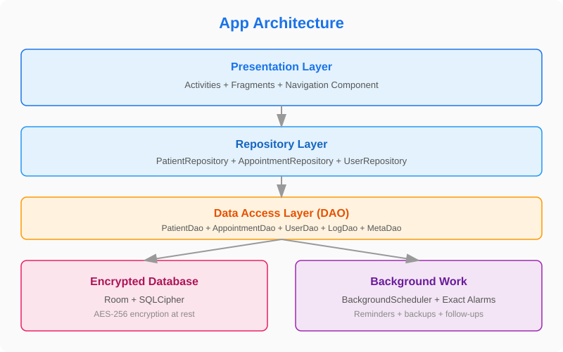
</p>

Built on a clean layered architecture:

| Layer | Description |
|---|---|
| **Presentation** | Single Activity (`MainActivity`) with 16 screens via Fragments and Navigation Component, 6-tab bottom nav |
| **Repositories** | `PatientRepository`, `AppointmentRepository`, `UserRepository` — each handles its own DAOs |
| **Data Access** | Room DAOs: `PatientDao`, `AppointmentDao`, `UserDao`, `LogDao`, `MetaDao`, plus 4 extras DAOs |
| **Database** | Room 2.6.1 + SQLCipher 4.8.0 (AES-256 encrypted), version 1 with no migrations |
| **Background** | `BackgroundScheduler` + `MedCareBackgroundService` + `BackgroundAlarmReceiver` + `BootReceiver` + WorkManager |

<br>

## Encryption Flow

<p align="center">
  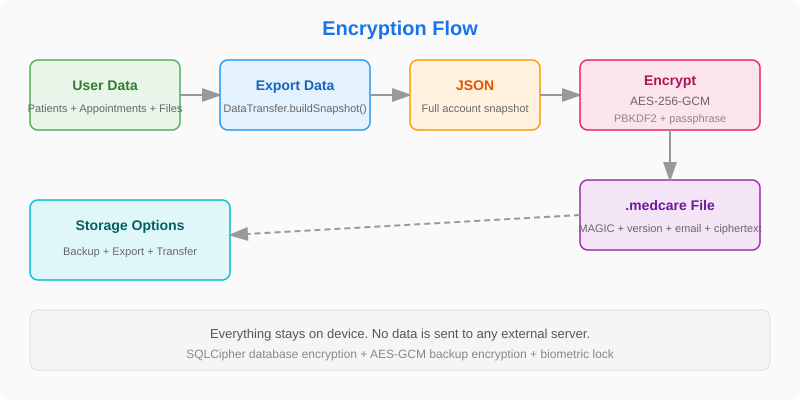
</p>

All data is encrypted at two levels:

**Database (daily use):**
- SQLCipher encrypts the entire SQLite file on device
- Key wrapped via Android Keystore (no plaintext anywhere on disk)
- `AppDatabase.ensureUsable` verifies the database can be opened on every launch
- If the key is lost (lock screen change, app data clear), the database is deleted and starts fresh

**Backups (on export):**
- `DataTransfer.buildSnapshot()` builds a full snapshot of the current account only (no password hash)
- Export: JSON -> AES-256-GCM encryption -> .medcare file
- PBKDF2 key derivation from passphrase (120,000 iterations)
- Each file contains: MAGIC("MEDBACKUP") + version(2) + email length + email + encrypted data
- Changing passphrase in settings re-encrypts all existing backups (`BackupManager.reencryptAll`)

<br>

## Device-to-Device Transfer

<p align="center">
  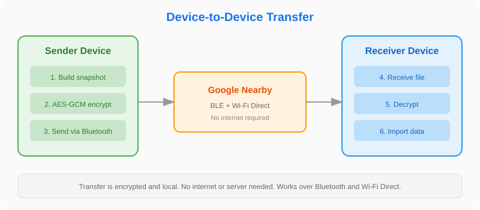
</p>

Transfer uses Google Nearby Connections with `P2P_CLUSTER` strategy:

**Sending (from Profile screen):**
- Permission checks: fine location, Bluetooth (API 31+), Wi-Fi devices (API 33+)
- Verify location services and Bluetooth are enabled
- Start advertising with service ID
- On connection accepted: build snapshot, save to temp file, send as `Payload.fromFile()`
- Clean up temp file on transfer success

**Receiving (from Login screen):**
- Same permission checks
- Start discovery for the same service ID
- On endpoint found: request connection
- On accepted: receive file via `Payload.File.asUri()`
- Parse JSON and call `DataTransfer.restoreSnapshot()` — transactional, id-safe restore
- `ImportFlow.handleRestoreResult()` handles the result

<br>

## Technology Stack

| Library | Version | Purpose |
|---|---|---|
| Room | 2.6.1 | Local database with DAOs and type converters |
| SQLCipher | 4.8.0 | Full database encryption on device |
| Navigation Component | 2.7.6 | Navigation between 16 screens via nav_graph.xml |
| Material Design 3 | 1.11.0 | UI components with 8 custom themes |
| Google Maps | 18.2.0 | Clinic map and patient locations |
| Google Places | 3.3.0 | Nearby clinic suggestions |
| Nearby Connections | 19.0.0 | Device-to-device transfer |
| WorkManager | 2.9.0 | Scheduled backups and reminders as safety net |
| Biometric | 1.2.0 | Biometric lock with process-death hardening |
| Gson | 2.10.1 | JSON serialization for backups and transfer |

<br>

## Building from Source

**Build requirements:**
- Android Studio Hedgehog or newer
- JDK 11+
- Android SDK 34

```bash
# Clone the repository
git clone https://github.com/zedreash/MedCare-App.git
cd MedCare-App

# Build debug APK
./gradlew assembleDebug

# Build release APK (requires keystore)
./gradlew assembleRelease
```

**Note:** For Google Maps, add your API key in `secrets.properties` at the project root:
```
MAPS_API_KEY=your_key_here
```

<br>

<p align="center">
  Your data stays on your device. Nothing is sent to any external server.
</p>
