<div dir="rtl">

<p align="left">
  <a href="README.md">العربية</a> · 
  <a href="README_en.md">English</a> · 
  <a href="README_he.md">עברית</a>
</p>

<p align="center">
  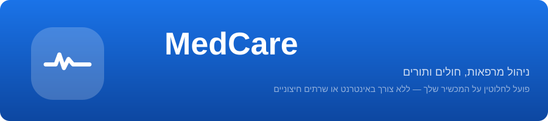
</p>

<p align="center">
  <a href="https://github.com/zedreash/MedCare-App/releases/download/v1.0.0/MedCare-v1.0.0.apk">
    
  </a>
</p>

<p align="center">
  
  
  
  
</p>

<br>

# MedCare

יישום אנדרואיד בקוד פתוח לניהול מרפאות, חולים ותורים. פועל לחלוטין על המכשיר ללא תלות באינטרנט או שרתים חיצוניים.

מרבית יישומי ניהול המרפאות דורשים חיבור יציב לאינטרנט ושרתים בענן. זה לא תמיד זמין. הפסקות חשמל, הפרעות קישוריות ותקלות בתשתית קורות מדי יום, במיוחד במקומות כמו פלסטין, מרפאות כפריות וצוותי בריאות ניידים.

MedCare נבנה למציאות זו. הכל פועל מקומית על מכשיר האנדרואיד שלך. רשומות חולים, תורים, גיבויים והעברות מתרחשים על הטלפון שלך ללא תלות חיצונית. אם האינטרנט ייפסק או המרפאה תאבד חשמל, הנתונים וזרימת העבודה שלך נשארים כפי שהיו.

עבודה ללא אינטרנט לא אומרת היעדר הגנה. מסד הנתונים מוצפן ב-SQLCipher על המכשיר, כך שאף אחד לא יוכל לגשת לנתוני חולים גם אם המכשיר ילך לאיבוד או ייגנב. גיבויים מוצפנים ב-AES-256-GCM תחת סיסמה שאתה שולט בה. נעילה ביומטרית שומרת על הגישה היומיומית לאפליקציה מאובטחת. וגיבויים אוטומטיים פועלים בלוח זמנים שאתה בוחר, כך שהנתונים מוגנים גם אם תשכח לבצע גיבוי ידני.

<br>

## צילומי מסך

<p align="center">
  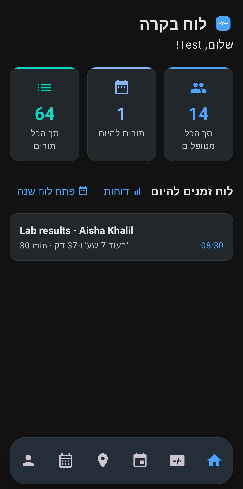
  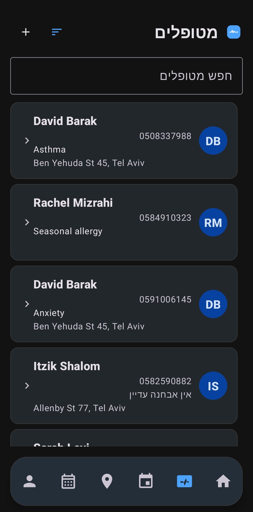
  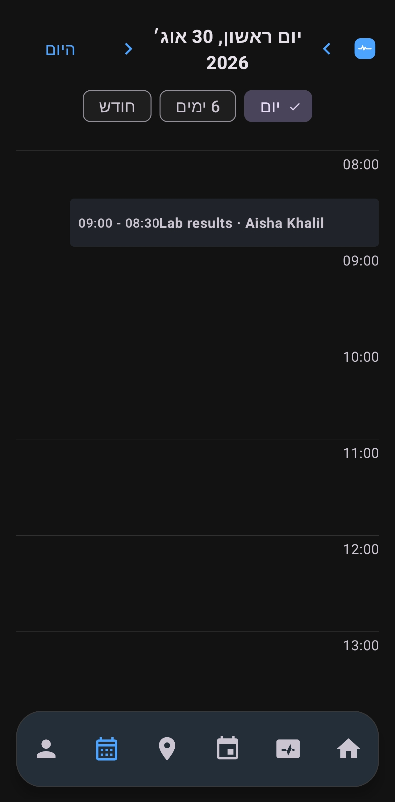
  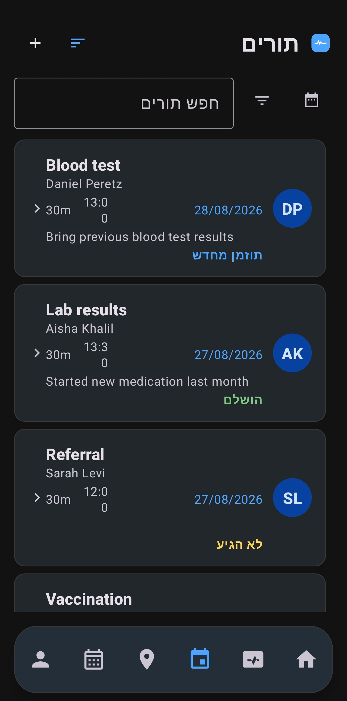
</p>

<p align="center">
  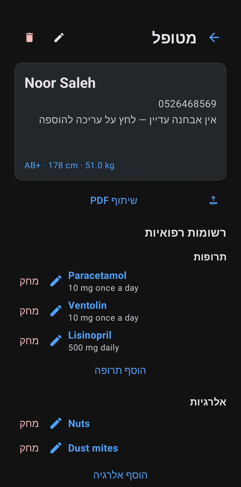
  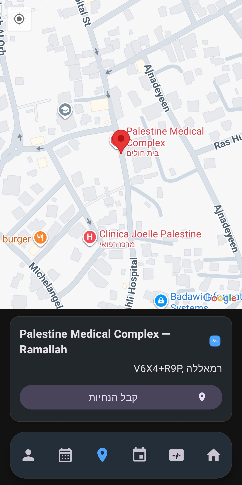
  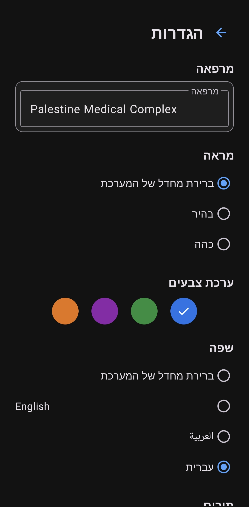
  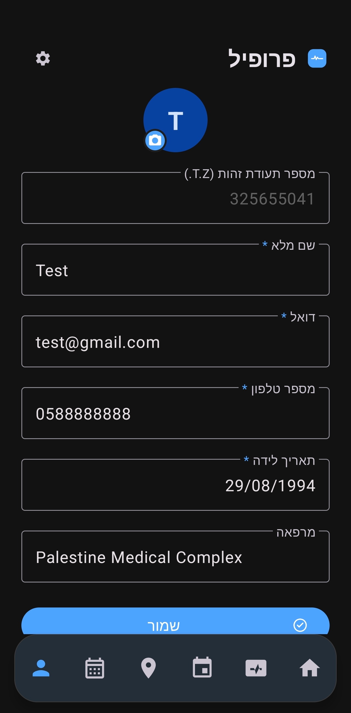
</p>

<br>

## תכונות עיקריות

### ניהול חולים

פרופיל חולים מקיף עם:
- שם מלא, טלפון, אבחון, כתובת, הערות
- מדדים: סוג דם (A+/-, B+/-, AB+/-, O+/-), גובה בס"מ, משקל בק"ג
- רשימת תרופות עם סטטוס פעיל/לא פעיל לכל תרופה (שם ו dosage)
- רשימת אלרגיות עם הערות לכל אלרגיה
- היסטוריה רפואית ותיעוד טיפול עם תאריכים ופרטים
- קבצים מצורפים: תמונות, מסמכים, כל סוגי הקבצים
- ייצוא סיכום חולים כקובץ PDF הכולל את כל הנתונים וכתובות עם reverse-geocoding
- מחיקת מטופל מוחקת אוטומטית את כל התורים, התרופות, האלרגיות, ההיסטוריה והקבצים המצורפים

### תורים ולוח שנה

3 תצוגות לוח שנה:
- **יומי**: קו שעות מ-00:00 до-23:00 עם קו "עכשיו" אדום, תורים ממוקמים לפי זמן עם גובה משך, הרחבה לאירועים חופפים
- **שבועי (6 ימים)**: 6 עמודות לכל יום עם שבבי תורים, עמודת היום הנוכחי מודגשת, לחיצה על כותרת עוברת לתצוגה יומית
- **חודשי**: רשת מסורתית עם נקודות צבעוניות לספירת תורים (עד 3 נקודות + "+N")

Swipe לניווט בין תאריכים עם אנימציות חלקות. כפתור "היום" לחזרה לתאריך הנוכחי.

תורים מחזוריים: יומי, שבועי, כל שבועיים, חודשי, רבעוני, שנתי, או מותאם אישית עם מספר חזרות מוגדר.

סטטוסים של תורים: מתוזמן, הושלם, לא הופיע, תוזמן מחדש, בוטל (כל סטטוס בצבע ייחודי). מסנן סטטוס עם בחירה מרובה ברשימת התורים.

תזכורות אוטומטיות עם זמן מוקדם מתכוונן (15 דק', 30 דק', שעה, יום, או מותאם אישית).

מעקב לאחר סיום התור: התראה "האם המטופל הופיע?" עם אפשרויות בלחיצה אחת: הופיע, לא הופיע, או לשאול שוב ב-30 דק' / שעה.

שינוי סטטוס ישירות ממסך פרטי התור. דחיית תור עם בוחר תאריך וזיהוי התנגשויות, תור זה בלבד או סדרה שלמה.

### עמוד המרפאה

מפות Google עם שלושה סוגי סימנים:
- סימנים כחולים: מיקום המשתמש הנוכחי
- סימון אדום: מיקום המרפאה
- סימנים ירוקים: כל המטופלים עם קואורדינטות

מידע על המרפאה עם שם וכתובת עם reverse-geocoding. כפתור "הנחיות" פותח את Google Maps לניווט.

לחיצה על סימון מטופל פותחת דיאלוג עם שם, טלפון, כתובת, אבחון ואפשרויות "צפה במטופל" ו"הנחיות".

רשימת מרפאות קרובות עם הצעות על בסיס מרחק (אוטומטית באזור ישראל/פלסטין, רשימה מותאמת elsewhere). שם וקואורדינטות של המרפאה ניתנים לעריכה מהפרופיל.

### דוחות ופעילות

מסך סטטיסטיקות מקיף המציג:
- סה"כ חולים, סה"כ תורים, תורים לחודש הנוכחי
- פילוח סטטוסים: מתוזמן, הושלם, לא הופיע, בוטל, תוזמן מחדש
- אחוז אי-הופעות כאחוז
- השעה העמוסה ביותר

יומן פעילות لكل חשבון עם חותמות זמן. ייצוא דוח כקובץ PDF לשיתוף.

### גיבוי והעברת נתונים

**גיבוי מוצפן בסיסמה**: ייצוא JSON, הצפנה ב-AES-256-GCM, שמירה כקובץ .medcare. שכיחות גיבוי אוטומטי: שעתי, יומי, שבועי, חודשי, או שנתי. שינוי סיסמה מוצפן מחדש את כל הגיבויים הקיימים אוטומטית.

כל קובץ גיבוי מכיל: MAGIC("MEDBACKUP") + גרסה(2) + אורך אימייל + אימייל + נתונים מוצפנים. רשימת גיבויים מציגה גודל קובץ, אימייל החשבון והחותמת זמן.

ייצוא וייבוא כקבצי .medcare עם הצפנת AES-GCM.

**העברה ישירה ממכשיר למכשיר**: שליחת נתונים לטלפון אחר דרך Bluetooth ו-Wi-Fi באמצעות Google Nearby Connections, ללא צורך באינטרנט. הוראות מוצגות לפני התחלת שליחה/קביעה. Bluetooth מופעל אוטומטית אם כבוי. תמיכה בחשבון מרובה כדי שחדרי מרפאה או ספקים יוכלו לחלוק מכשיר אחד, כל חשבון עם נתונים מבודדים לחלוטין. תמונת פרופיל לכל חשבון עם אחסון מקומי וגיבוי.

שחזור אוטומטי: בפתיחת האפליקציה בפעם הראשונה עם קבצי גיבוי זמינים, מוצג דיאלוג עם הגיבוי האחרון לכל חשבון.

### אבטחה ופרטיות

- **הצפנת מסד נתונים**: SQLCipher מצפין את קובץ SQLite כולו על המכשיר, המפתח עטוף דרך Android Keystore, אין מפתח טקסטואלי בדיסק. `AppDatabase.ensureUsable` בודק את אפשרות פתיחת מסד הנתונים בכל הפעלה.
- **הצפנת גיבוי**: AES-256-GCM עם PBKDF2 לחילוץ מפתח מהסיסמה (120,000 מחזורים). שינוי סיסמה בהגדרות מוצפן מחדש את כל הגיבויים הקיימים.
- **נעילת ביומטריקה**: טביעת אצבע או זיהוי פנים עם קריפטוגרפיה חזקה, מחוסנת מפני הפעלה מחדש
- **sesions קשורים לחשבון**: יציאה מוחקת את הsesion
- **מחיקת נתונים**: מוחק את כל הנתונים של החשבון הנוכחי בלבד (חולים, תורים, יומני פעילות, קבצים מצורפים, תמונת פרופיל וחשבון המשתמש עצמו) עם אימות סיסמה ואימות מילה
- **מחיקת חשבון**: אותה פעולת מחיקה פר-חשבון, מוגבלת לחשבון הנוכחי בלבד
- אף נתון אינו נשלח לשרת חיצוני

### רישום והגדרה

תהליך רישום בן 6 שלבים:
1. **טופס חשבון**: מספר זהות, שם מלא, אימייל, טלפון, תאריך לידה, סיסמה + אישור, מרפאה (עם הצעות Places)
2. **סיסמת גיבוי**: מחולל סיסמאות אקראי מאובטח (22 תווים), מדד חוזק, אישור "שמרתי אותה"
3. **בחירת ערכת נושא**: כחול, ירוק, סגול, כתום
4. **נעילת ביומטריקה**: הפעלה או דילוג
5. **תדירות גיבוי**: כבוי / שעתי / יומי / שבועי / חודשי / שנתי
6. **עבודת רקע**: ויתור על אופטימיזציית סוללה + הרשאת אזעקות מדויקות

8 ערכות נושא מובנות (4 צבעים x 2 מצבים: בהיר/כהה + מערכת). 3 שפות: ערבית, אנגלית, עברית עם תמיכה מלאה ב-RTL. כפתור globe להחלפת שפות במסכי כניסה ורישום.

### עבודה במהימנה

- **BackgroundScheduler**: מפעיל אזעקה מדויקת אחת (`setExactAndAllowWhileIdle`) לרגע הקרוב ביותר שצריך עבודת רקע (תזכורת, גיבוי, מעקב)
- **MedCareBackgroundService**: שירות רקע קצר מועד שמבצע עבודה תורמת ואז מפעיל מחדש את האזעקה
- **BootReceiver**: מפעיל מחדש אזעקות לאחר הפעלת המכשיר
- הוראות ויתור על אופטימיזציית סוללה במהלך הרישום
- WorkManager כרשת ביטחון אם אזעקות מדויקות הוחמצו
- שחזור אוטומטי של אזעקות לאחר הפעלת המכשיר

<br>

## ארכיטקטורת האפליקציה

<p align="center">
  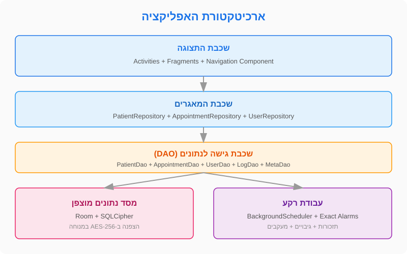
</p>

בנוי על ארכיטקטורת שכבות פשוטה ונקייה:

| שכבה | תיאור |
|---|---|
| **תצוגה** | Activity אחת (`MainActivity`) עם 16 מסכים דרך Fragments ו-Navigation Component, ناو ب traumatique תחתית עם 6 טאבים |
| **מאגרים** | `PatientRepository`, `AppointmentRepository`, `UserRepository` — כל אחד מטפל ב-DAO שלו |
| **גישה לנתונים** | Room DAOs: `PatientDao`, `AppointmentDao`, `UserDao`, `LogDao`, `MetaDao`, ועוד 4 DAOs נוספים |
| **מסד נתונים** | Room 2.6.1 + SQLCipher 4.8.0 (מוצפן ב-AES-256), גרסה 1 ללא הגירות |
| **רקע** | `BackgroundScheduler` + `MedCareBackgroundService` + `BackgroundAlarmReceiver` + `BootReceiver` + WorkManager |

<br>

## נתיב הצפנה

<p align="center">
  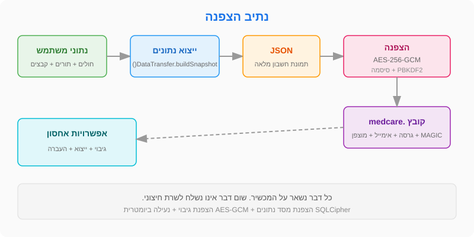
</p>

כל הנתונים מוצפנים בשתי רמות:

**מסד נתונים (בשימוש יומיומי):**
- SQLCipher מצפין את קובץ SQLite כולו על המכשיר
- המפתח עטוף דרך Android Keystore (אין טקסטואלי בדיסק)
- `AppDatabase.ensureUsable` בודק את אפשרות פתיחת מסד הנתונים בכל הפעלה
- אם המפתח אבד (שינוי נעילת מסך, ניקוי נתוני אפליקציה), מסד הנתונים נמחק ומתחיל מאפס

**גיבויים (בייצוא):**
- `DataTransfer.buildSnapshot()` בונה תמונה מלאה של החשבון הנוכחי בלבד (ללא סיסמת אימות)
- ייצוא: JSON → הצפנת AES-256-GCM → קובץ .medcare
- PBKDF2 לחילוץ מפתח מהסיסמה (120,000 מחזורים)
- כל קובץ מכיל: MAGIC("MEDBACKUP") + גרסה(2) + אורך אימייל + אימייל + נתונים מוצפנים
- שינוי סיסמה בהגדרות מוצפן מחדש את כל הגיבויים הקיימים (`BackupManager.reencryptAll`)

<br>

## העברת מכשיר למכשיר

<p align="center">
  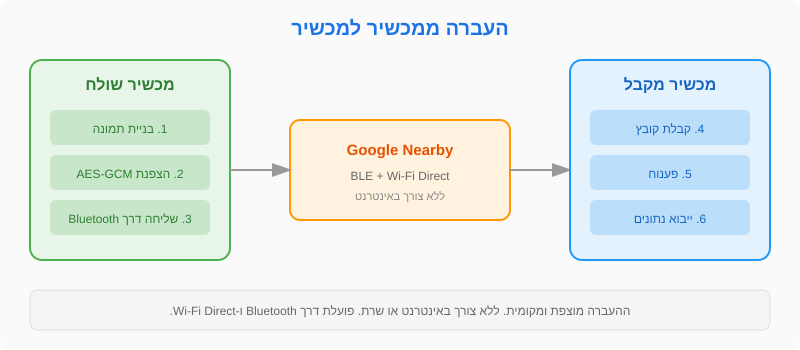
</p>

ההעברה נעשית דרך Google Nearby Connections עם אסטרטגיית `P2P_CLUSTER`:

**שליחה (ממסך הפרופיל):**
- בדיקת הרשאות: מיקום מדויק, Bluetooth (API 31+), מכשירי Wi-Fi (API 33+)
- בדיקת הפעלת שירותי מיקום ו-Bluetooth
- התחלת פרסום (`advertising`) עם מזהה שירות
- בקבלת חיבור: בניית תמונה ושמירה בקובץ זמני ושליחה כ-`Payload.fromFile()`
- מחיקת הקובץ הזמני לאחר הצלחת ההעברה

**קביעה (ממסך כניסה):**
- בדיקת הרשאות זהה
- התחלת חיפוש (`discovery`) לאותו מזהה שירות
- במציאת נקודה סופית: בקשת חיבור
- בקבלה: קבלת הקובץ וקריאה דרך `Payload.File.asUri()`
- ניתוח JSON וקריאה ל-`DataTransfer.restoreSnapshot()` — ייבוא בטיפול ובátימות
- `ImportFlow.handleRestoreResult()` מטפל בתוצאה

<br>

## מחסנית טכנולוגיות

| ספרייה | גרסה | שימוש |
|---|---|---|
| Room | 2.6.1 | מסד נתונים מקומי עם DAOs וממירים |
| SQLCipher | 4.8.0 | הצפנת מסד נתונים מלאה על המכשיר |
| Navigation Component | 2.7.6 | ניווט בין 16 מסכים דרך nav_graph.xml |
| Material Design 3 | 1.11.0 | רכיבי ממשק עם 8 ערכות נושא מותאמות |
| Google Maps | 18.2.0 | מפת מרפאה ומיקומי חולים |
| Google Places | 3.3.0 | הצעות מרפאות קרובות |
| Nearby Connections | 19.0.0 | העברת מכשיר למכשיר |
| WorkManager | 2.9.0 | גיבויים מתוזಮים ותזכורות כרשת ביטחון |
| Biometric | 1.2.0 | נעילה ביומטרית מחוסנת מפני הפעלה מחדש |
| Gson | 2.10.1 | סריאליזציית JSON לגיבויים ולהעברה |

<br>

## בנייה ממקור

**דרישות בנייה:**
- Android Studio Hedgehog או חדש יותר
- JDK 11+
- Android SDK 34

```bash
# שכפול המאגר
git clone https://github.com/zedreash/MedCare-App.git
cd MedCare-App

# בניית APK בדיקה
./gradlew assembleDebug

# בניית APK סופי (מRequires keystore)
./gradlew assembleRelease
```

**הערה:** למפות Google, הוסף את מפתח ה-API בקובץ `secrets.properties` בשורש הפרויקט:
```
MAPS_API_KEY=המפתח שלך כאן
```

<br>

<p align="center">
  הנתונים שלך נשארים על המכשיר שלך. שום דבר אינו נשלח לשרת חיצוני.
</p>

</div>
